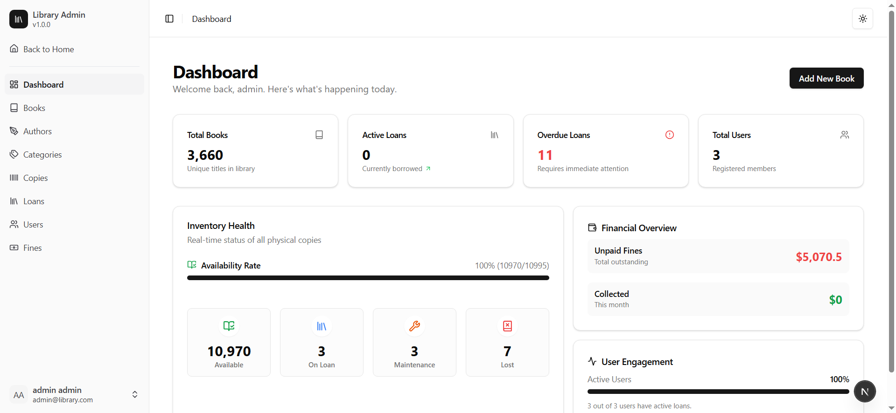
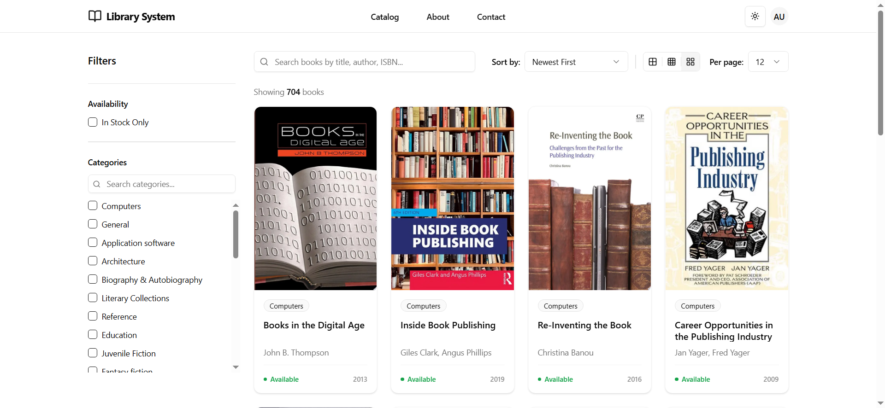
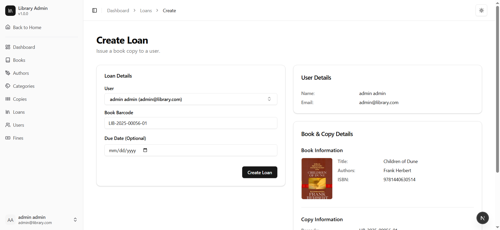
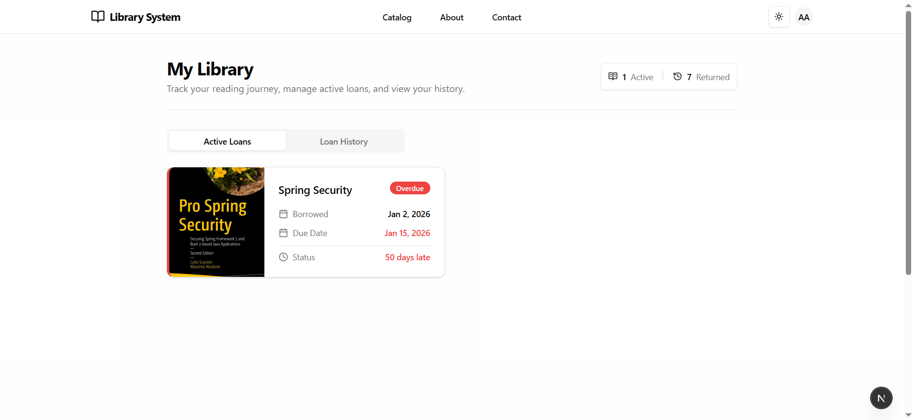
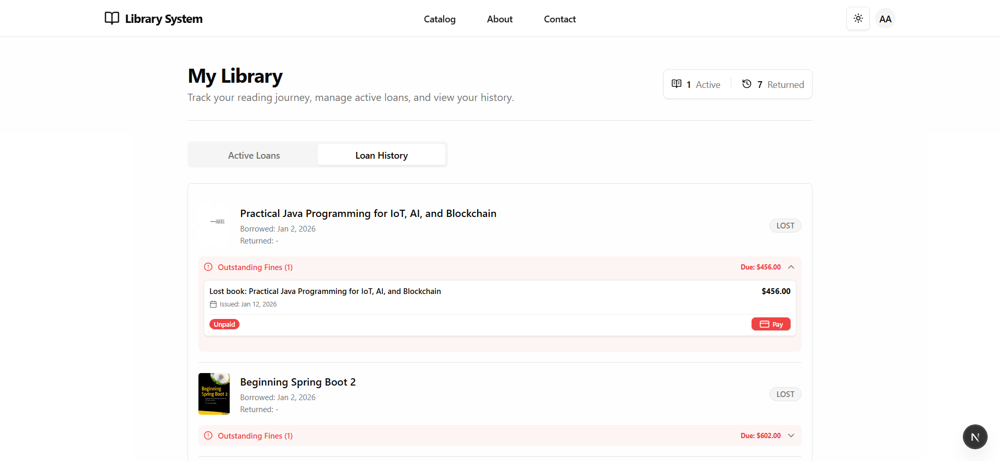
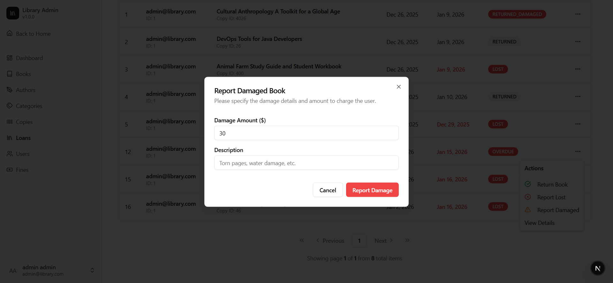
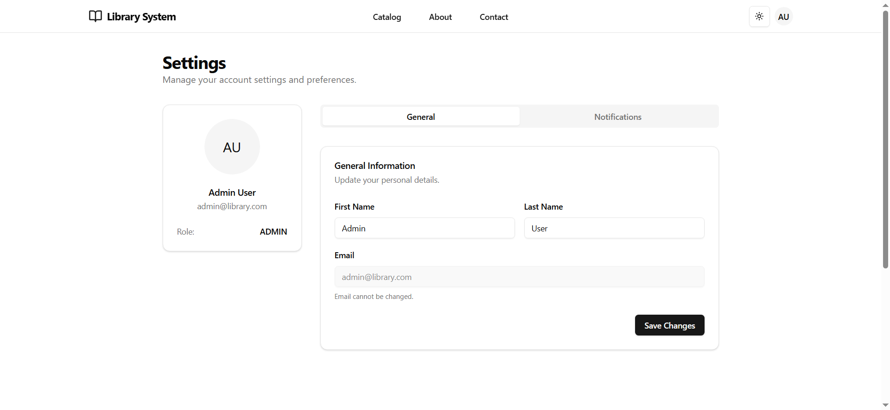
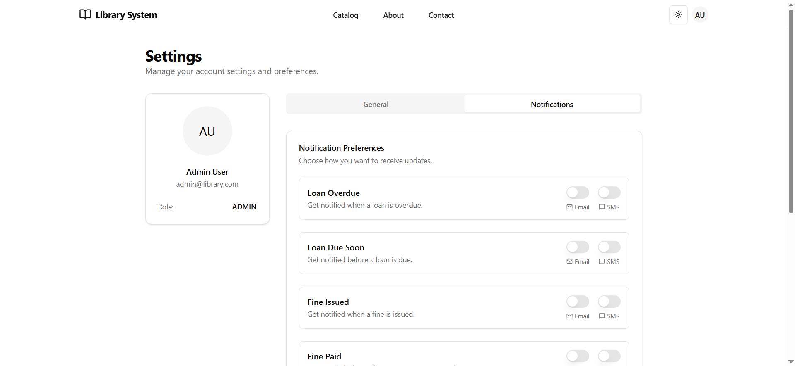

# Library Management System


A full-stack library management application built with **Spring Boot** and **Next.js**.

This started as a standard school project, but I decided to push it further to focus on designing a solid REST API. The current frontend is built with Next.js. But my roadmap includes a partial or full migration to TanStack Start in the near future to experiment with its routing and ecosystem. I am seeking advantages of server-side rendering and other capabilities I can to fulfill the needs of catalog and inventory features of this project. 

## Table of Contents

- [Features](#features)
- [Gallery](#gallery)
- [Getting Started](#getting-started)
- [Project Architecture](#project-architecture)
- [Technologies Used](#technologies-used)
- [Configuration](#configuration)
- [Security & Authentication](#security--authentication)
- [API Reference](#api-reference)
- [API Response Format](#api-response-format)

## Features

### Authentication & Security
- **Secure Login/Register:** JWT-based stateless authentication.
- **Role-Based Access Control (RBAC):** Distinct permissions for **Users** and **Admins**.
- **Token Management:** Access and Refresh token rotation for enhanced security.

### Catalog Management
- **Book Management:** Create, update, and delete books with rich metadata (ISBN, Publisher, Year).
- **Author & Category Management:** Organize books by authors and categories. Planning to support multiple categories for books.
- **Copy Management:** Track individual physical copies of books and their status (Available, Loaned, Lost).
- **Advanced Search:** Filter books dynamically by title, author, category, or ISBN. It uses JPA Specification API in background.

### Circulation & Loans
- **Borrowing System:** Library staff create and manage loan records on behalf of users. Future updates include reservation system.
- **Return Process:** Streamlined return workflow with automatic fine calculation for overdue items. Books can also be marked as "Damaged" or "Lost".
- **Loan History:** Users can view their current and past loans. Can see their fines categorized.
- **Fine Management:** Automated fine generation for overdue books, with admin capabilities to waive or adjust fines.
- **Payment Processing:** Integrated mock payment service for fine settlements.

### Fine Calculation
The system uses a adaptive approach to calculate overdue fines based on user history.

- **Standard Policy:**
    - Applies a fixed daily fine for overdue items.
    - Used for users in good standing.

- **Progressive Policy:**
    - Implements a tiered fine structure where the daily rate increases the longer a book remains overdue.
    - Encourages timely returns for long-overdue items.

- **Dynamic Adaptation:**
    - The system automatically switches between policies based on the user's history.
    - Users with a history of frequent overdue items (e.g., more than 5 past fines) are subject to the stricter Progressive Policy, while responsible users remain on the Standard Policy.

### User Management
- **Profile Management:** Users can update their personal information and notification preferences.
- **Admin Dashboard:** Comprehensive view of system statistics (Total Users, Active Loans, Overdue Books).
- **User Administration:** Admins can view user lists, ban/unban users, and manage their active loans.

### Notifications
- **Email Alerts:** Automated email notifications for:
    - Loan confirmations
    - Due date reminders
    - Overdue alerts
    - Fine issuance
- **Preferences:** Users can customize which notifications they receive.

## Gallery

Explore the user interface and key features of the Library Management System.

### Dashboard


### Book Catalog


### Loan Operations
**Create Loan**


**Active Loans**


**Loan History**


**Report Damaged Book**


### Settings
**General Settings**


**Notification Preferences**


Go to `docs/screenshots` for more.

## Getting Started

### 1. Clone the Repository

```bash
git clone https://github.com/yigitgirit/library-management-system.git
cd library-management-system
```

### 2. Choose Your Setup Method

You can run the project using **Docker** (Recommended) or from **Source**.

#### Option A: Docker (Recommended)
The fastest way to spin up the entire stack. Requires Docker Desktop.

**Prerequisites:**
- [Docker Desktop](https://www.docker.com/products/docker-desktop/)

**Steps:**

1.  Copy the environment file:
    ```bash
    cp .env.example .env
    ```
2.  Start the services:
    ```bash
    docker-compose up --build
    ```

---

#### Option B: From Source
If you want to run the backend and frontend locally while keeping the database in Docker.

**Prerequisites:**
- **Java 21** (JDK 21)
- **Node.js 24+**
- **Docker Desktop** (for Database)

**Steps:**

1.  **Environment Setup:**
    ```bash
    # Backend
    cp apps/spring-boot-app/.env.example apps/spring-boot-app/.env

    # Frontend
    cp apps/nextjs-app/.env.example apps/nextjs-app/.env.local
    ```

2.  **Start Database in Docker:**
    Open a terminal and run:
    ```bash
    docker-compose -f docker-compose.db.yaml up -d
    ```

3.  **Start Backend:**
    In the same or a new terminal, run:
    ```bash
    cd apps/spring-boot-app
    ./mvnw spring-boot:run
    ```
    *Wait until you see "Started LibraryManagementSystemApplication" in the logs.*

4.  **Start Frontend:**
    Open a **new terminal** and run:
    ```bash
    cd apps/nextjs-app
    npm install
    npm run dev
    ```

---

### Access the Application

- **Frontend:** [http://localhost:3000](http://localhost:3000)
- **Backend API:** [http://localhost:8080](http://localhost:8080)
- **API Docs:** [http://localhost:8080/swagger-ui.html](http://localhost:8080/swagger-ui.html)

## Project Architecture

The project follows a **Monorepo** structure, separating the frontend and backend into distinct applications that communicate via REST API.

### 1. Backend (`apps/spring-boot-app`)
The backend is built with **Spring Boot** and follows a **Modular Monolith** architecture. Code is organized by domain features rather than technical layers.

```
src/main/java/me/seyrek/library_management_system/
├── auth/           # Authentication & JWT logic
├── author/         # Author management
├── book/           # Book management (CRUD, Search)
├── category/       # Category management
├── common/         # Shared utilities & exceptions
├── config/         # App-wide configurations (Swagger, CORS)
├── copy/           # Book copy management
├── dashboard/      # Dashboard statistics
├── exception/      # Global exception handling
├── fine/           # Fine calculation & payment logic
├── loan/           # Loan processing & business rules
├── notification/   # Email notification services
├── payment/        # Payment processing
├── security/       # Spring Security configuration
└── user/           # User management & profiles
```

### 2. Frontend (`apps/nextjs-app`)
The frontend is built with **Next.js 16 (App Router)** and follows a feature-based structure.

```
src/
├── app/               # Next.js App Router pages & layouts
│   ├── (auth)/        # Auth-related pages (Login, Register)
│   ├── (dashboard)/   # Protected dashboard pages
│   └── (marketing)/   # Public marketing pages
├── components/        # Shared UI components (Shadcn UI)
├── features/          # Feature-specific components & logic
│   ├── auth/          # Login/Register forms & hooks
│   ├── authors/       # Author management
│   ├── books/         # Book list, details, & search
│   ├── categories/    # Category management
│   ├── common/        # Shared feature components
│   ├── copies/        # Book copy management
│   ├── dashboard/     # Dashboard widgets & charts
│   ├── fines/         # Fine management
│   ├── loans/         # Loan history & active loans
│   ├── notification/  # Notification preferences
│   └── users/         # User management
├── lib/               # Utilities & Configuration
├── config/            # App configuration & constants
└── types/             # TypeScript interfaces & types
```

## Technologies Used

### Frontend Layer
- **Framework:** Next.js 16.1 (App Router)
- **Language:** TypeScript
- **UI Library:** React 19
- **Styling:** Tailwind CSS
- **Components:** Shadcn UI (Radix UI)
- **State Management:** Zustand (Client), TanStack Query (Server/Async)
- **Form Handling:** React Hook Form + Zod
- **HTTP Client:** Axios

### Backend Layer
- **Framework:** Spring Boot 3.5.7
- **Language:** Java 21
- **ORM:** Spring Data JPA (Hibernate)
- **Security:** Spring Security (JWT)
- **Documentation:** SpringDoc OpenAPI (Swagger UI)
- **Utilities:** Lombok, MapStruct, Apache Commons

### Database & Infrastructure
- **Database:** PostgreSQL 17
- **Containerization:** Docker & Docker Compose
- **Build Tools:** Maven (Backend), NPM (Frontend)

## Configuration

The project uses environment variables for configuration across different environments.

### 1. Docker Environment (Root `.env`)
Used when running the project via `docker-compose up`.

| Variable | Description | Default      |
|----------|-------------|--------------|
| `JWT_SECRET_KEY` | Shared secret for signing tokens | *Required*   |
| `POSTGRES_DB` | Database name | `library`    |
| `POSTGRES_USER` | Database username | `postgres`   |
| `POSTGRES_PASSWORD` | Database password | `secretbook` |
| `SPRING_MAIL_USERNAME` | SMTP Username | -            |
| `SPRING_MAIL_PASSWORD` | SMTP Password | -            |
| `BACKEND_PORT` | Host port for Backend | `8080`       |
| `FRONTEND_PORT` | Host port for Frontend | `3000`       |
| `DATABASE_PORT` | Host port for Database | `5433`       |

### 2. Local Environment (App-Specific)
Used when running applications from source (`mvnw` or `npm run dev`).

**Backend (`apps/spring-boot-app/.env`):**

| Variable | Description | Default |
|----------|-------------|---------|
| `SPRING_DATASOURCE_URL` | JDBC URL | `jdbc:postgresql://localhost:5432/library` |
| `SPRING_DATASOURCE_USERNAME` | DB User | `postgres` |
| `SPRING_DATASOURCE_PASSWORD` | DB Password | `secretbook` |
| `JWT_SECRET_KEY` | Must match the frontend's secret | *Required* |
| `SPRING_MAIL_USERNAME` | SMTP Username | - |
| `SPRING_MAIL_PASSWORD` | SMTP Password | - |

**Frontend (`apps/nextjs-app/.env.local`):**

| Variable | Description | Default |
|----------|-------------|---------|
| `NEXT_PUBLIC_API_URL` | Backend API URL | `http://localhost:8080` |
| `JWT_SECRET_KEY` | Must match the backend's secret | *Required* |

### Spring Boot Configuration (`application.properties`)
Key settings in `src/main/resources/application.properties`:
- **Database Initialization:** `spring.sql.init.mode=never` (Relies on Docker init scripts).
- **Hibernate DDL:** `spring.jpa.hibernate.ddl-auto=validate` (Validates schema only).
- **JWT Expiration:** Access Token (15m), Refresh Token (30d).

## Security & Authentication

The application implements a robust security architecture to handle credentials and sessions securely.

### 1. JWT Authentication Flow
- **Stateless:** The server does not store session state. Identity is verified via **JSON Web Tokens (JWT)**.
- **Dual Token System:**
    - **Access Token:** Short-lived (15 mins), used for API requests.
    - **Refresh Token:** Long-lived (30 days), stored in the database, used to obtain new access tokens.

### 2. Frontend-Backend Communication
- **Browser Client (`browser-client.ts`):**
    - Intercepts 401 responses.
    - Automatically attempts to refresh the session using the Refresh Token.
    - Queues concurrent requests during refresh to prevent race conditions.
    - Logs the user out if refresh fails.
- **Server Client (`server-client.ts`):**
    - Used by Next.js Server Components.
    - Retrieves the Access Token directly from `HttpOnly` cookies for secure server-side data fetching.

### 3. Credential Safety
- **Passwords:** Hashed using **BCrypt** before storage.
- **Secrets:** Sensitive keys (JWT Secret, DB Password) are injected via environment variables, never hardcoded.
- **CORS:** Configured to allow requests only from the trusted frontend origin.


## API Reference

The API is organized around RESTful principles. Below are the key endpoints categorized by resource.

### Authentication
| Method | Endpoint | Description |
|--------|----------|-------------|
| `GET` | `/api/auth/register` | Register a new user |
| `POST` | `/api/auth/login` | Authenticate and receive tokens |
| `POST` | `/api/auth/refresh` | Refresh access token |
| `POST` | `/api/auth/logout` | Invalidate session |

### User Management
| Method | Endpoint | Description |
|--------|----------|-------------|
| `GET` | `/api/users/me` | Get current user profile |
| `PUT` | `/api/users/me` | Update current user profile |
| `GET` | `/api/users/{id}` | Get public user profile |
| `GET` | `/api/management/users` | List all users (Admin only) |
| `POST` | `/api/management/users` | Create a new user (Admin only) |
| `GET` | `/api/management/users/{id}` | Get user details by ID (Admin only) |
| `PUT` | `/api/management/users/{id}` | Update user details (Admin only) |
| `DELETE` | `/api/management/users/{id}` | Delete a user (Admin only) |
| `POST` | `/api/management/users/{id}/ban` | Ban a user (Admin only) |
| `POST` | `/api/management/users/{id}/unban` | Unban a user (Admin only) |

### Books Management
| Method | Endpoint | Description |
|--------|----------|-------------|
| `GET` | `/api/books` | List books (with pagination & search) |
| `GET` | `/api/books/{id}` | Get book details by ID |
| `POST` | `/api/management/books` | Create a new book (Admin only) |
| `PUT` | `/api/management/books/{id}` | Update book details (Admin only) |
| `PATCH` | `/api/management/books/{id}` | Patch book details (Admin only) |
| `DELETE` | `/api/management/books/{id}` | Delete a book (Admin only) |

### Authors Management
| Method | Endpoint | Description |
|--------|----------|-------------|
| `GET` | `/api/authors` | List all authors |
| `GET` | `/api/authors/{id}` | Get author details by ID |
| `POST` | `/api/management/authors` | Create a new author (Admin only) |
| `PUT` | `/api/management/authors/{id}` | Update author details (Admin only) |
| `DELETE` | `/api/management/authors/{id}` | Delete an author (Admin only) |

### Categories Management
| Method | Endpoint | Description |
|--------|----------|-------------|
| `GET` | `/api/categories` | List all categories |
| `GET` | `/api/categories/{id}` | Get category details by ID |
| `POST` | `/api/management/categories` | Create a new category (Admin only) |
| `PUT` | `/api/management/categories/{id}` | Update category details (Admin only) |
| `DELETE` | `/api/management/categories/{id}` | Delete a category (Admin only) |

### Book Copies Management
| Method | Endpoint | Description |
|--------|----------|-------------|
| `GET` | `/api/copies` | List book copies (with pagination) |
| `GET` | `/api/copies/{id}` | Get copy details by ID |
| `GET` | `/api/copies/by-barcode/{barcode}` | Get copy details by Barcode |
| `POST` | `/api/management/copies` | Create a new book copy (Admin/Librarian) |
| `PUT` | `/api/management/copies/{id}` | Update copy details (Admin/Librarian) |
| `PATCH` | `/api/management/copies/{id}` | Patch copy details (Admin/Librarian) |
| `POST` | `/api/management/copies/{id}/retire` | Retire (soft delete) a book copy (Admin/Librarian) |

### Loans Management
| Method | Endpoint | Description |
|--------|----------|-------------|
| `GET` | `/api/loans/my-loans` | Get current user's loans |
| `GET` | `/api/management/loans` | List all loans (Admin/Librarian) |
| `GET` | `/api/management/loans/{id}` | Get loan details by ID (Admin/Librarian) |
| `POST` | `/api/management/loans` | Create a new loan (Admin/Librarian) |
| `POST` | `/api/management/loans/{id}/return` | Return a borrowed book (Admin/Librarian) |
| `POST` | `/api/management/loans/{id}/report-lost` | Report a book as lost (Admin/Librarian) |
| `POST` | `/api/management/loans/{id}/report-damaged` | Report a book as damaged (Admin/Librarian) |
| `PUT` | `/api/management/loans/{id}` | Update loan details (Admin only) |
| `PATCH` | `/api/management/loans/{id}` | Patch loan details (Admin only) |
| `DELETE` | `/api/management/loans/{id}` | Delete a loan (Admin only) |

### Fines Management
| Method | Endpoint | Description |
|--------|----------|-------------|
| `GET` | `/api/fines/my-fines` | Get current user's fines |
| `POST` | `/api/fines/{id}/pay` | Pay a fine |
| `GET` | `/api/management/fines` | List all fines (Admin only) |
| `GET` | `/api/management/fines/{id}` | Get fine details by ID (Admin only) |
| `POST` | `/api/management/fines` | Create a fine manually (Admin only) |
| `PUT` | `/api/management/fines/{id}` | Update fine details (Admin only) |
| `PATCH` | `/api/management/fines/{id}` | Patch fine details (Admin only) |

### Dashboard
| Method | Endpoint | Description |
|--------|----------|-------------|
| `GET` | `/api/dashboard/stats` | Get system statistics (Admin only) |

### Notifications
| Method | Endpoint | Description |
|--------|----------|-------------|
| `GET` | `/api/notification-preferences` | Get user notification preferences |
| `PUT` | `/api/notification-preferences` | Update notification preferences |

*For a complete and interactive list of endpoints, visit the **Swagger UI** at `http://localhost:8080/swagger-ui.html` after starting the backend.*


## Response Format

The backend uses a standardized JSON structure for all API responses, ensuring consistency and ease of consumption for the frontend.

### 1. Success Response
All successful requests return an `ApiResponse<T>` object.

```json
{
  "success": true,
  "timestamp": "2023-10-27T10:00:00Z",
  "message": "Operation successful",
  "data": {
    "id": 1,
    "name": "Example Item"
  }
}
```

### 2. Error Response
Failed requests return a structured error object within the `ApiResponse`.

```json
{
  "success": false,
  "timestamp": "2023-10-27T10:05:00Z",
  "error": {
    "code": "RESOURCE_NOT_FOUND",
    "message": "Book not found with id: 1",
    "details": null
  }
}
```

**Error Codes:**
The `code` field in error responses corresponds to predefined error codes in the `ErrorCode.java` enum file. These codes are systematically categorized:
- `E1xxx`: User and generic business logic errors
- `E2xxx`: Authentication and security errors
- `E3xxx`: Data validation and request format errors
- `E4xxx`: Library domain-specific business logic errors
- `E5xxx`: Generic system errors

**Validation Errors:**
For validation failures (e.g., invalid form data), the `details` field contains specific field errors.

```json
{
  "success": false,
  "timestamp": "2023-10-27T10:10:00Z",
  "error": {
    "code": "VALIDATION_ERROR",
    "message": "Validation failed",
    "details": [
      {
        "field": "email",
        "message": "must be a well-formed email address"
      }
    ]
  }
}
```

### 3. Paginated Response
Endpoints returning lists of data use a `PagedData<T>` wrapper to provide pagination metadata.

```json
{
  "success": true,
  "timestamp": "2023-10-27T10:15:00Z",
  "data": {
    "content": [
      { "id": 1, "title": "Book 1" },
      { "id": 2, "title": "Book 2" }
    ],
    "page": {
      "size": 20,
      "totalElements": 100,
      "totalPages": 5,
      "number": 0
    }
  }
}
```
